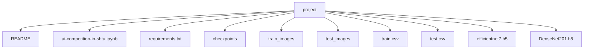

# AI-Competition-in-SHTU
## 前话
&emsp;&emsp;GitHub项目不是很熟悉（原谅我这个菜鸡），好像上传不了25mb以上的文件，所以后面的预训练权重和数据集需要复现的用户再去下载，然后需要说明的是本方案训练使用了一块A6000显卡，显存占用率达到将近48G，如果用户运行代码出现cuda out of memory情况，可以把batchsize从32降低到16或者8，如果想实现大batchsize效果减少由小batchsize带来的训练时长增加，可以在本方案基础上增加gradient accumulation方案。
## 环境搭建
&emsp;&emsp;代码运行环境是python3.10，cuda版本是12.2

```
conda create -n competition python==3.10.12
conda activate competition
pip install -r requirements.txt
```
## 下载预训练权重
&emsp;&emsp;efficientnet预训练权重链接：https://github.com/Callidior/keras-applications/releases/download/efficientnet/efficientnet-b7_weights_tf_dim_ordering_tf_kernels_autoaugment_notop.h5

&emsp;&emsp;densenet预训练权重链接：https://storage.googleapis.com/tensorflow/keras-applications/densenet/densenet201_weights_tf_dim_ordering_tf_kernels_notop.h5

&emsp;&emsp;下载完两个权重文件后，将其分别重命名为efficientnet7.h5和DenseNet201.h5，将其放与ipynb文件同级即可。

## 下载数据集
&emsp;&emsp;数据集链接：[the-1st-datatech-alchemist-cup-public-dataset](https://www.kaggle.com/datasets/hongori/the-1st-datatech-alchemist-cup-public-dataset)，点击download下载数据，将压缩包解压到工程目录即可。

&emsp;&emsp;下载完上面需要的文件后，项目结构应该如下所示：

&emsp;&emsp;checkpoints文件是模型训练生成的保存最优模型的文件夹。

## 模型训练与评估
&emsp;&emsp;将下载好的文件放在上面项目结构图所示的位置上，一键运行ipynb文件即可，因为最后提交的方案是比赛结束前两天的方案，参数记得咋训练的，但不确定efficientnet的学习率方案是哪个呢，如果最后生成的submmision与本人kaggle不一致，请将ipynb文件中下面这一行对应的代码注释取消，并重新训练一下efficientnet，将最佳模型权重覆盖掉之前训练的模型权重，如果给你的复现工作带来了麻烦，非常抱歉。

`# models = load_and_fit_models('efficientnet',myepoch=80,mypatience=30)`
